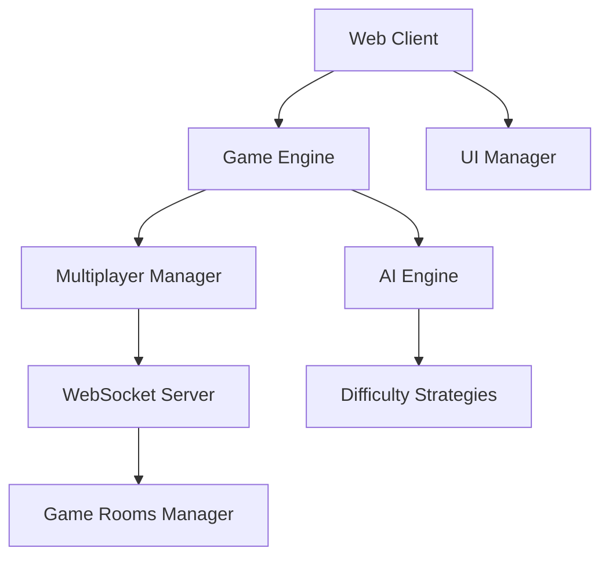

# Rock Paper Scissors Game Design Document

## Overview

This design document outlines the architecture for a web-based Rock Paper Scissors game supporting both Player vs AI and Player vs Player modes. The system will be built using modern web technologies with a client-server architecture to support real-time multiplayer gameplay and intelligent AI opponents.

## Architecture

### High-Level Architecture



### Technology Stack

- **Frontend**: HTML5, CSS3, JavaScript (ES6+)
- **Backend**: Node.js with Express.js
- **Real-time Communication**: WebSocket (Socket.IO)
- **State Management**: In-memory storage for game sessions
- **Deployment**: Web-based application (can be hosted locally or on cloud platforms)

## Components and Interfaces

### 1. Game Engine (Core Component)

The central component that orchestrates all game logic and state management.

**Responsibilities:**
- Manage game state and flow
- Coordinate between AI and multiplayer modes
- Handle move validation and result calculation
- Manage scoring and session lifecycle

**Key Methods:**
```javascript
class GameEngine {
    startGame(mode, options)
    makeMove(playerId, move)
    calculateResult(move1, move2)
    endGame()
    getGameState()
}
```

### 2. AI Engine

Implements the artificial intelligence for Player vs AI mode with three difficulty levels.

**AI Strategies:**

**Easy Mode:**
- Random move selection
- No pattern recognition
- 33.33% win rate target against optimal play

**Medium Mode:**
- Basic pattern recognition (tracks last 3-5 moves)
- Simple frequency analysis
- Counter-strategy based on player tendencies
- 50-60% win rate target

**Hard Mode:**
- Advanced pattern recognition (Markov chains)
- Adaptive strategy that learns from player behavior
- Meta-strategy switching
- 70-80% win rate target

**Key Methods:**
```javascript
class AIEngine {
    constructor(difficulty)
    analyzePlayerHistory(moves)
    predictNextMove(playerHistory)
    makeMove()
    updateStrategy(result)
}
```

### 3. Multiplayer Manager

Handles all aspects of online multiplayer functionality.

**Responsibilities:**
- WebSocket connection management
- Room creation and joining
- Player matchmaking
- Synchronization of game state between players
- Handling disconnections and reconnections

**Key Methods:**
```javascript
class MultiplayerManager {
    createRoom()
    joinRoom(roomCode)
    broadcastMove(roomId, playerId, move)
    handleDisconnection(playerId)
    syncGameState(roomId)
}
```

### 4. UI Manager

Manages all user interface interactions and visual feedback.

**Responsibilities:**
- Render game screens and components
- Handle user input and interactions
- Display game results and animations
- Manage responsive design across devices

**Key Methods:**
```javascript
class UIManager {
    renderModeSelection()
    renderGameBoard()
    displayResult(result)
    showConnectionStatus()
    handleUserInput(input)
}
```

### 5. WebSocket Server

Server-side component for real-time communication.

**Responsibilities:**
- Handle WebSocket connections
- Manage game rooms
- Broadcast messages between players
- Maintain connection health

## Data Models

### Game State Model
```javascript
{
    gameId: string,
    mode: 'pvp' | 'pvai',
    players: [
        {
            id: string,
            name: string,
            score: number,
            currentMove: 'rock' | 'paper' | 'scissors' | null,
            isReady: boolean
        }
    ],
    currentRound: number,
    maxRounds: number,
    status: 'waiting' | 'playing' | 'finished',
    winner: string | null,
    aiDifficulty: 'easy' | 'medium' | 'hard' | null
}
```

### Room Model (Multiplayer)
```javascript
{
    roomId: string,
    roomCode: string,
    players: string[],
    maxPlayers: 2,
    gameState: GameState,
    createdAt: Date,
    isActive: boolean
}
```

### AI History Model
```javascript
{
    playerId: string,
    moveHistory: string[],
    patterns: {
        sequences: Map<string, number>,
        frequencies: Map<string, number>,
        lastMoves: string[]
    },
    adaptationLevel: number
}
```

## Error Handling

### Client-Side Error Handling

1. **Connection Errors**
   - Automatic retry mechanism with exponential backoff
   - Fallback to offline mode when server unavailable
   - Clear error messages for network issues

2. **Input Validation**
   - Validate moves before sending to server
   - Prevent duplicate move submissions
   - Handle timeout scenarios gracefully

3. **State Synchronization**
   - Detect and recover from desynchronized states
   - Request state refresh when inconsistencies detected

### Server-Side Error Handling

1. **Room Management**
   - Handle room capacity limits
   - Clean up abandoned rooms
   - Validate room codes and player permissions

2. **WebSocket Management**
   - Handle connection drops gracefully
   - Implement heartbeat mechanism
   - Queue messages during temporary disconnections

3. **Game Logic**
   - Validate all moves server-side
   - Prevent cheating through client manipulation
   - Handle edge cases in game state transitions

## Testing Strategy

### Unit Testing

1. **Game Logic Tests**
   - Test move validation and result calculation
   - Verify scoring system accuracy
   - Test AI decision-making algorithms

2. **AI Engine Tests**
   - Test each difficulty level independently
   - Verify pattern recognition accuracy
   - Test adaptation mechanisms

3. **Multiplayer Logic Tests**
   - Test room creation and joining
   - Verify message broadcasting
   - Test disconnection handling

### Integration Testing

1. **Client-Server Communication**
   - Test WebSocket message flow
   - Verify state synchronization
   - Test error propagation

2. **End-to-End Game Flow**
   - Test complete PvP game sessions
   - Test complete PvAI game sessions
   - Test mode switching and navigation

### Performance Testing

1. **Concurrent Users**
   - Test multiple simultaneous games
   - Verify server performance under load
   - Test memory usage and cleanup

2. **AI Performance**
   - Measure AI response times
   - Test pattern recognition efficiency
   - Verify difficulty scaling

### User Experience Testing

1. **Responsive Design**
   - Test on various screen sizes
   - Verify touch interactions on mobile
   - Test accessibility features

2. **Network Conditions**
   - Test under poor network conditions
   - Verify graceful degradation
   - Test offline mode functionality

## Security Considerations

1. **Input Validation**
   - Sanitize all user inputs
   - Validate move submissions server-side
   - Prevent injection attacks

2. **Rate Limiting**
   - Limit move submission frequency
   - Prevent spam and abuse
   - Implement connection throttling

3. **Room Security**
   - Generate secure room codes
   - Validate player permissions
   - Prevent unauthorized access

## Performance Optimizations

1. **Client-Side**
   - Implement efficient DOM updates
   - Use CSS animations for smooth transitions
   - Minimize network requests

2. **Server-Side**
   - Implement connection pooling
   - Use efficient data structures for game state
   - Implement automatic room cleanup

3. **Network**
   - Minimize message payload sizes
   - Implement message compression
   - Use efficient serialization formats